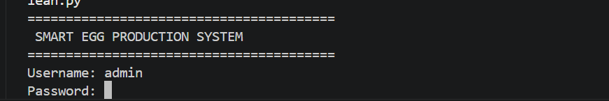
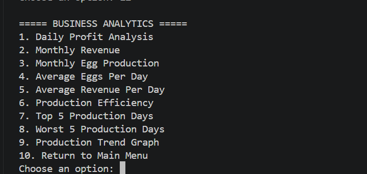

# 🥚 Smart Egg Production System

A Python-based poultry farm management and analytics application designed to record egg production, monitor farm performance, analyse operational efficiency, manage users, and generate professional reports.
---

## ✨ Key Features

### 🔐 Login & Authentication

- Role-based login authentication
- Three login attempts
- Multiple users
- User roles and access levels

---

## 🐔 Farm Management

- Add Record
- View Records
- Search Records
- Edit Records
- Delete Records

---

## Reports### 👥 User Roles

**Administrator**
- Add users
- View users
- Change passwords
- Delete users

**Manager**
- View users
- Change password

**Employee**
- Login
- Use the farm system

## 📊 Analytics & Reports
- Production Summary
- Farm Dashboard
- Business Analytics
- Production Forecast
- Feed Efficiency Analysis

---

## 📄 Reports & Export

- Excel Report
- PDF Report

---

## 🛠️ Technologies

- Python
- Pandas
- Matplotlib
- OpenPyXL
- ReportLab

---

## 🚀 How to Run

1. Install Python 3.x.
2. Clone or download this repository.
3. Open the project folder in VS Code.
4. Install the required Python packages.

Run:

`pip install pandas matplotlib openpyxl reportlab customtkinter`

5. Start the application.

`python smart_egg_system_v2.py`

> Note: The application uses local CSV files for storing farm records and user account data. Login credentials are not included in this public repository.

## 📁 Project Files

- `smart_egg_system_clean.py` — Main Python application
- `smart_egg_system_v2.py` — Version 2 GUI application
- `records.csv` — Production records
- `Egg_Production_Report.xlsx` — Excel report
- `Egg_Production_Report.pdf` — PDF report
- `Screenshots/` — Application screenshots
- `.gitignore` — Files excluded from version control

---
## 🔒 Authentication & Security

The application includes role-based authentication with Administrator, Manager, and Employee access levels.

Login credentials and user account data are not included in this public repository.
# 📸 Screenshots

## 🔐 Login Screen

---

## 🏠 Main Menu

---

## 📊 Farm Dashboard

---

## 📈 Business Analytics

## 📈 Business Analytics

---

## 👥 User Management

---

## 👩‍💻 Developer

Developed by **Ntombizodwa Mnisi**

**Version:** 1.0